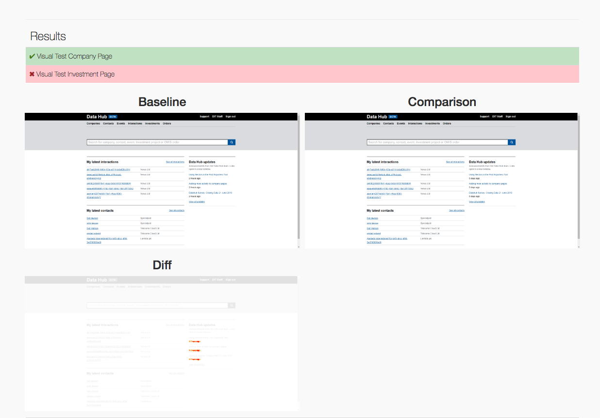

# Reporting

A report can be generated after the suite is executed.

Baseline, comparison and diff images will only be added to the report for failing tests.

## Cypress support index

### Generate default HTML report
Add the following after hook

```js
// cypress/support/index.js for Cypress versions below 10
// cypress/support/{scheme}.js for Cypress versions 10 and above, where {scheme} defaults to e2e
after(() => {
  cy.task('generateReport')
})
```

The report will look something like:



### Generate Custom HTML report

If you want to generate your custom report, generate a report json file by passing `JSON_REPORT` in the [custom config file](../README.md#custom-config-file), and build your own HTML file from this json. 

See [example.json](../report-example.json)

## Folder structure

When a report is generated it will create the following folder:

```
    .
    ├── cypress-visual-report
```

There will be enhancements coming in to make the folder name/location configurable.
